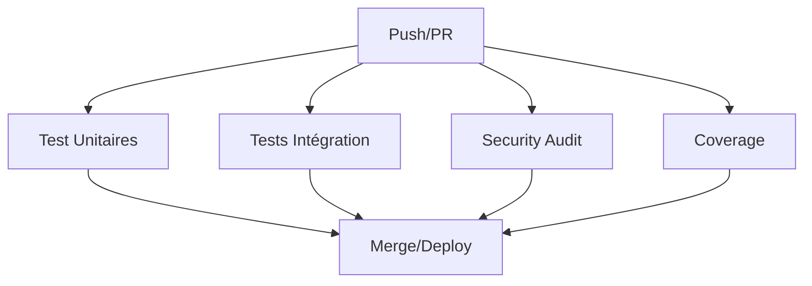

# 🧪 Stratégie de Tests - API Lorem Ipsum

## 📋 Vue d'ensemble

Notre stratégie de tests suit une approche pyramidale pour garantir la qualité et les performances de l'API Lorem Ipsum :

```
      🔺 E2E Tests (Few)
     🔸🔸 Integration Tests (Some) 
   🔹🔹🔹🔹 Unit Tests (Many)
```

## 🏗️ Architecture des Tests

### 📁 Structure des fichiers

```
tests/
├── integration.rs      # Tests d'intégration API
├── performance.rs      # Tests de performance
└── e2e/               # Tests end-to-end (futurs)
    └── api_flows.rs

src/
├── domain/
│   └── tests/         # Tests unitaires domaine
├── application/
│   └── tests/         # Tests unitaires use cases
└── infrastructure/
    └── tests/         # Tests unitaires infrastructure
```

### 🎯 Types de Tests

#### 1. 🔹 Tests Unitaires
- **Localisation** : `src/*/tests/` et `#[cfg(test)]` modules
- **Objectif** : Tester chaque composant isolément
- **Couverture** : Logique métier, validation, transformations
- **Exécution** : `cargo test --lib`

#### 2. 🔸 Tests d'Intégration
- **Localisation** : `tests/integration.rs`
- **Objectif** : Tester l'interaction entre modules
- **Couverture** : API endpoints, flux complets, base de données
- **Exécution** : `cargo test --test integration`

#### 3. ⚡ Tests de Performance
- **Localisation** : `tests/performance.rs`
- **Objectif** : Vérifier les performances sous charge
- **Couverture** : Temps de réponse, throughput, mémoire
- **Exécution** : `cargo test --test performance -- --ignored`

## 🚀 Optimisations CI/CD

### ⚡ Améliorations apportées

1. **🔄 Actions GitHub mises à jour**
   - ❌ `actions-rs/toolchain@v1` (déprécié)
   - ✅ `dtolnay/rust-toolchain@stable` (moderne)
   - ❌ `actions-rs/audit@v1` (déprécié)
   - ✅ `cargo audit` (direct)

2. **📊 Coverage optimisé**
   - ❌ `cargo-tarpaulin` (lent, limité)
   - ✅ `cargo-llvm-cov` (rapide, précis)
   - ✅ Support tests unitaires ET d'intégration
   - ✅ Cache optimisé pour chaque job

3. **🔀 Jobs parallèles**
   ```yaml
   test:        # Tests unitaires rapides
   integration: # Tests d'intégration
   security:    # Audit sécurité
   coverage:    # Coverage (master seulement)
   ```

### 📈 Métriques de Performance

#### ⏱️ Temps d'exécution attendus
- **Tests unitaires** : < 30s
- **Tests d'intégration** : < 2min
- **Tests de performance** : < 5min
- **Coverage complet** : < 3min

#### 🎯 Objectifs de qualité
- **Coverage** : > 80%
- **Tests unitaires** : > 90% du code métier
- **Tests d'intégration** : Tous les endpoints
- **Performance** : P95 < 100ms

## 🧪 Commandes de Test

### 🏃 Tests rapides (développement)
```bash
# Tests unitaires seulement
cargo test --lib

# Tests avec coverage
cargo llvm-cov --open
```

### 🔍 Tests complets (CI)
```bash
# Tous les tests sauf performance
cargo test

# Tests d'intégration spécifiques
cargo test --test integration

# Tests de performance
cargo test --test performance -- --ignored
```

### 📊 Coverage détaillé
```bash
# Coverage avec détails par module
cargo llvm-cov --all-features --workspace --lcov --output-path lcov.info

# Coverage HTML pour navigation
cargo llvm-cov --all-features --workspace --html
```

## 🎯 Coverage Strategy

### 📐 Zones prioritaires

1. **🔥 Coverage critique (100%)**
   - Logique métier (Domain)
   - Validation des données
   - Gestion d'erreurs

2. **⚡ Coverage important (90%)**
   - Use cases (Application)
   - API endpoints
   - Transformations de données

3. **🛠️ Coverage standard (70%)**
   - Infrastructure
   - Configuration
   - Utilitaires

### 🚫 Exclusions de coverage
```rust
// Code généré automatiquement
#[cfg(not(tarpaulin_include))]

// Tests eux-mêmes
#[cfg(test)]

// Code de configuration/setup
fn main() { ... }
```

## 🔄 Workflow GitHub Optimisé

### 📋 Jobs parallèles pour rapidité



### ⚙️ Configuration avancée

1. **🗄️ Cache intelligent**
   - Cache séparé par type de test
   - Invalidation sur changement Cargo.lock
   - Réutilisation entre jobs

2. **🎯 Exécution conditionnelle**
   - Coverage : master branch seulement
   - Performance : release/tags seulement
   - Integration : toutes les branches

3. **📤 Artifacts et rapports**
   - Coverage reports vers Codecov
   - Performance benchmarks stockés
   - Logs détaillés pour debugging

## 🚀 Prochaines Étapes

### 📅 Phase 1 : Fondations (Actuel)
- ✅ Structure de tests mise en place
- ✅ CI/CD optimisé
- ✅ Coverage configuré

### 📅 Phase 2 : Implémentation
- 🔄 Tests unitaires pour chaque module DDD
- 🔄 Tests d'intégration pour API
- 🔄 Tests de performance sous charge

### 📅 Phase 3 : Avancé
- 📋 Tests E2E avec vraie base de données
- 📋 Tests de sécurité automatisés
- 📋 Benchmarks continus

## 🎉 Avantages de cette approche

1. **⚡ Rapidité** : Jobs parallèles, cache optimisé
2. **🎯 Précision** : Coverage précis avec llvm-cov
3. **🔄 Complétude** : Unitaires, intégration ET performance
4. **🛡️ Robustesse** : Actions modernes, moins de failures
5. **📊 Visibilité** : Rapports détaillés, métriques claires

Cette stratégie garantit une couverture complète tout en maintenant des temps de build rapides ! 🚀
